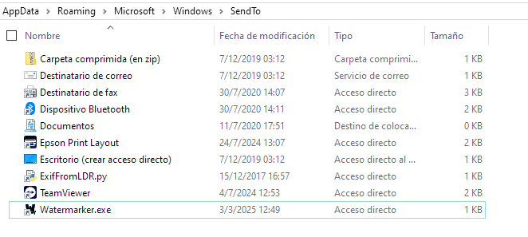
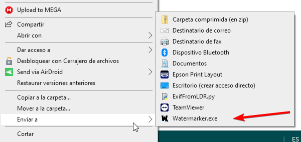

# To Use:

- Make a shortcut of Watermark.exe file
- Windows + R and write: shell:sendTo
- 
- Copy the shortcut to that folder
- Now you can right click in any image and got to the SEND TO option and it will watermark that image

